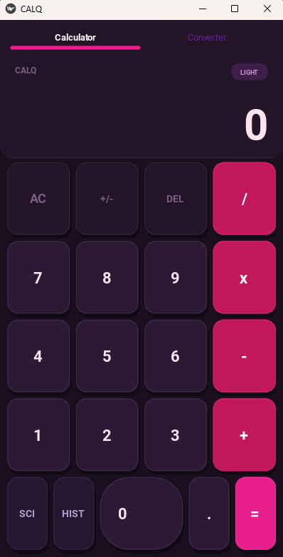
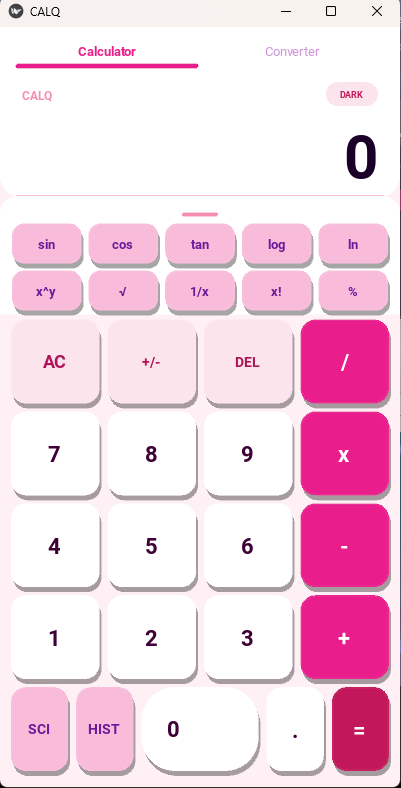
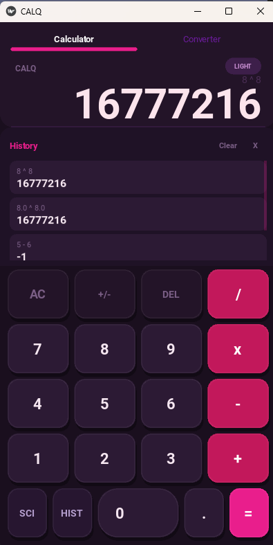
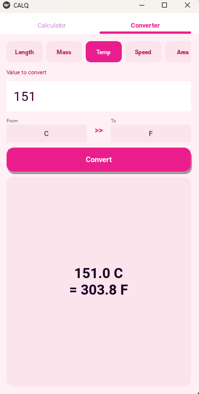

# Smart Calculator
<p align="center"></p>
<p align="center">
  
  
  
</p>

A charming, multi-paradigm calculator built with **Python** and **Kivy**. This project demonstrates how the same mathematical logic can be implemented using different software architecture styles, all wrapped in a cute, user-friendly interface.

## Project Structure

```
SmartCalculator/
├── ui/
│   └── main.py                  # Kivy UI entry point
├── paradigms/
│   ├── procedural.py            # Procedural paradigm
│   ├── oop_calculator.py        # OOP paradigm (Calculator class)
│   ├── functional.py            # Functional paradigm
│   └── event_driven.py          # Event-driven paradigm
├── extras/
│   └── additional_features.py  # Extended math + history
└── README.md
```

## 📸 Screenshots

<table width="100%">
  <tr>
    <td align="center" valign="top">
      <strong>Dark Mode</strong><br><br>
      
    </td>
    <td align="center" valign="top">
      <strong>Light Mode</strong><br><br>
      
    </td>
  </tr>
  <tr>
    <td align="center" valign="top">
      <strong>History</strong><br><br>
      
    </td>
    <td align="center" valign="top">
      <strong>Converter Tab</strong><br><br>
      
    </td>
  </tr>
</table>

## 🛠️ Programming Paradigms

The "Smart" in this calculator comes from its ability to process expressions using four distinct architectural approaches. You can toggle these using the **Spinner (Dropdown)** in the UI.

### 🏗️ Object-Oriented (OOP)
* **Encapsulation:** Logic is bundled within a `Calculator` class.
* **Instance-Based:** Uses class methods to handle calculations, allowing for future stateful expansions (like memory buttons).
* **File:** `paradigms/oop_calculator.py`

### 🌿 Functional
* **Pure Functions:** Operations take inputs and return outputs without modifying any external state.
* **Expression-First:** Relies on mapping operators to functions for a clean, mathematical flow.
* **File:** `paradigms/functional.py`

### 🛠️ Procedural
* **Linear Execution:** Follows a traditional, step-by-step logic flow using standard conditional blocks.
* **Simplicity:** Minimal overhead, focusing on a direct sequence of parsing commands.
* **File:** `paradigms/procedural.py`

### ⚡ Event-Driven
* **Signal-Based:** Calculation logic is decoupled and triggered by UI interaction events.
* **Reactive Flow:** Designed to feel responsive and handle data only when the "equals" signal is fired.
* **File:** `paradigms/event_driven.py`

---

## 🌟 Key Features

* ✨ **Extended Math:** Native support for `^` (exponent), `√` (square root), and `%` (percentage).
* 🌓 **Theme Toggle:** Switch between ☀️ **Light** and 🌙 **Dark** modes with a cute toggle.
* 📟 **Live Expression Display:** Shows the full equation above the result, mimicking a real scientific calculator.
* 🛡️ **Smart Error Handling:** Captures syntax errors and division by zero gracefully without crashing.
* 📜 **Calculation History:** Every successful result is logged and can be retrieved via the `additional_features` module.

---

## 🚀 Getting Started

### 1. Install Dependencies
Make sure you have Python installed, then install the Kivy framework:
```bash
pip install kivy
```

### 2. Run the App

Launch the main entry point:

```bash
python ui/main.py
```

## 📱 Mobile Deployment (Android)

This project is fully compatible with **Buildozer**. To generate your own Android APK:

1. Install Buildozer: `pip install buildozer`
2. In your `buildozer.spec`, ensure `source.include_exts = py,kv` and `requirements = python3,kivy`.
3. Run the build:

```bash
buildozer android debug
```

## 🤝 Meet the Team
Developed with passion by:

* 🎀 Franchezca Banayad (@chezca-v)
✨ Princess Mae Sanchez (@cessamaeeee)
👨‍💻 Jose Jerico Escaño (@Jose-Jerico)
🌟 Ysa Frigillana (@ysaf-dev)
👩‍💻 Elena Lanuza (@lenadevug)
⚡ Karl Esteban (@krljsph09)

### Contributors
Thanks to all the amazing contributors who have helped make this project better!
[](https://github.com/username/repo/graphs/contributors)